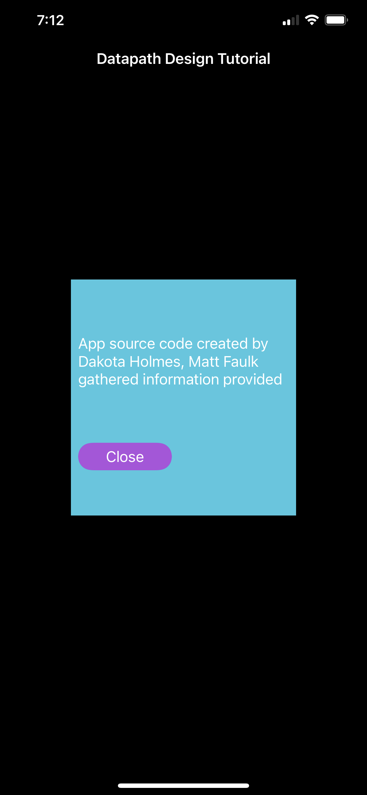

 

  

  <h3 align="center">CPU Datapath Design Mobile App (Swift)</h3>

  

   An awesome educational tool for educating developers on computer architecture CPU datapath design elements.
     
  Created by Matt Faulk & Dakota Holmes
     
  
  

<!-- ABOUT THE PROJECT -->
## About The Project

  Understanding how computers work can be a daunting task. To the average person, the complex systems that make up these machines may as well be witchcraft. This is why we decided to create a beginner friendly mobile application that unmasks the mystery behind how the average CPU (Central Processing Unit) works at a microarchitectural level.
  
 
  

 
 

### Built With

* [Swift](https://developer.apple.com/swift/)
* [Xcode 13](https://developer.apple.com/xcode/)

  
## Usage

 Below we have several screenshots of the mobile application, displaying the main page and the collapsible view function.
  

  
  
  
 
 
 
 
 
 
  

<!-- CONTACT -->
## Contact

Matthew Faulk - mkf61@txstate.edu
 
Dakota Holmes - holmesdakota28@gmail.com

<!-- MARKDOWN LINKS & IMAGES -->
<!-- https://www.markdownguide.org/basic-syntax/#reference-style-links -->
[contributors-shield]: https://img.shields.io/github/contributors/othneildrew/Best-README-Template.svg?style=for-the-badge
[contributors-url]: https://github.com/othneildrew/Best-README-Template/graphs/contributors
[forks-shield]: https://img.shields.io/github/forks/othneildrew/Best-README-Template.svg?style=for-the-badge
[forks-url]: https://github.com/othneildrew/Best-README-Template/network/members
[stars-shield]: https://img.shields.io/github/stars/othneildrew/Best-README-Template.svg?style=for-the-badge
[stars-url]: https://github.com/othneildrew/Best-README-Template/stargazers
[issues-shield]: https://img.shields.io/github/issues/othneildrew/Best-README-Template.svg?style=for-the-badge
[issues-url]: https://github.com/othneildrew/Best-README-Template/issues
[license-shield]: https://img.shields.io/github/license/othneildrew/Best-README-Template.svg?style=for-the-badge
[license-url]: https://github.com/othneildrew/Best-README-Template/blob/master/LICENSE.txt
[linkedin-shield]: https://img.shields.io/badge/-LinkedIn-black.svg?style=for-the-badge&logo=linkedin&colorB=555
[linkedin-url]: https://linkedin.com/in/othneildrew
[product-screenshot]: images/screenshot.png
